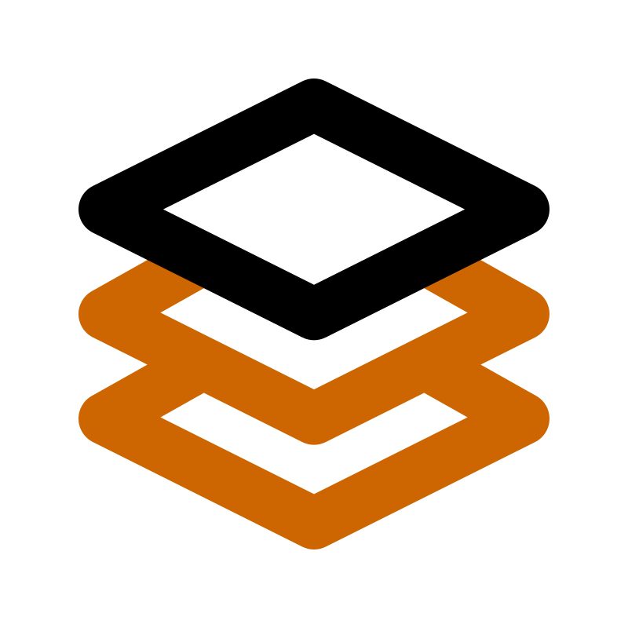
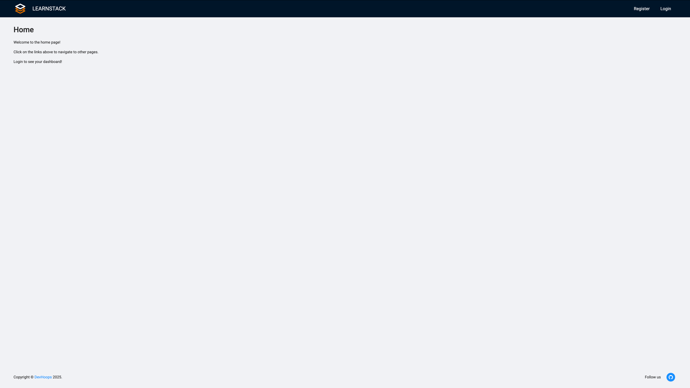
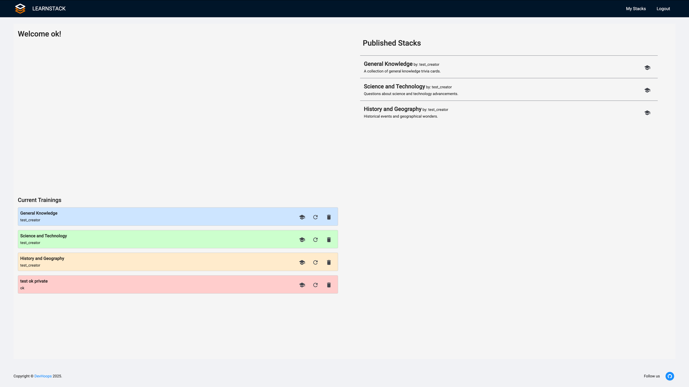
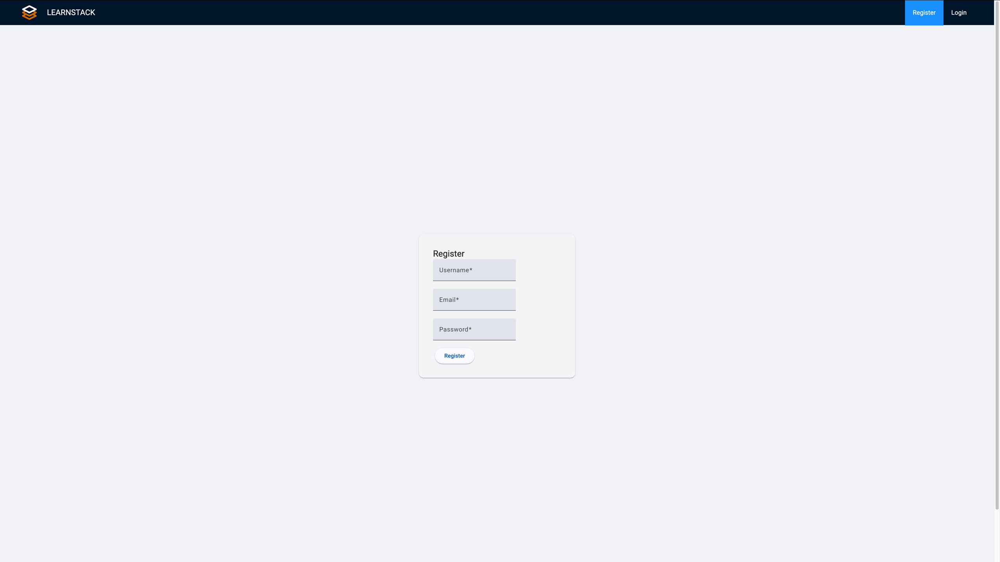
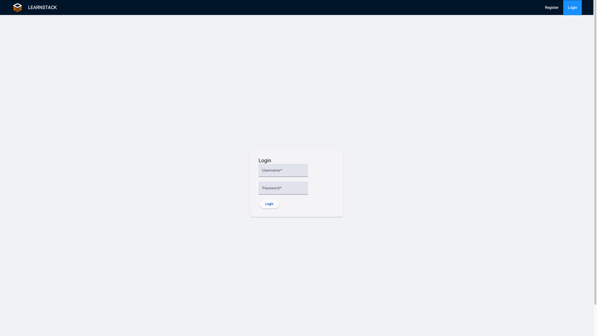
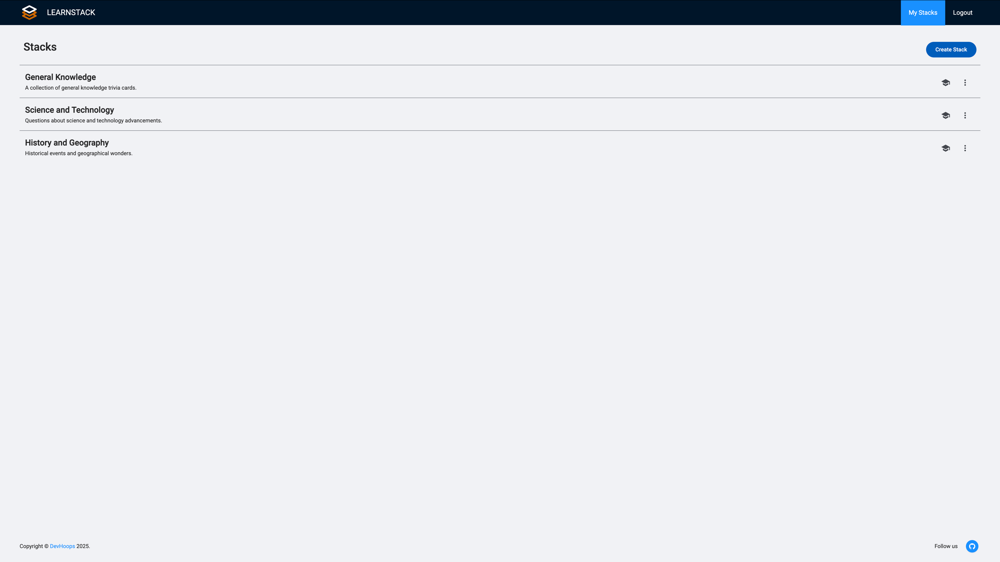
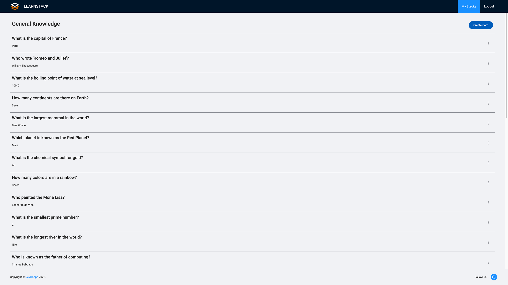
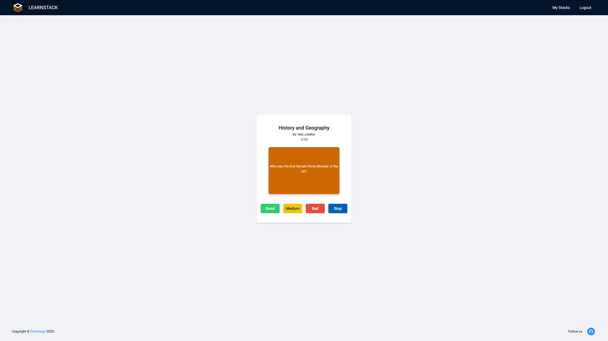
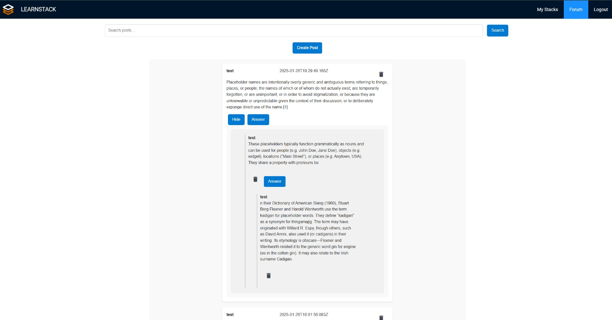

<h1 align="center">
  <a href="https://github.com/okaluk/ude-wt-project">
    <!-- Please provide path to your logo here -->
    <picture width= "100" height="100">
      <source media="(prefers-color-scheme: dark)" srcset="docs/images/learnstack-dark.svg">
      <source media="(prefers-color-scheme: light)" srcset="docs/images/learnstack-light.svg">
      
    </picture>
  </a>
</h1>

<div align="center">
  LearnStack
  <br />
  <a href="#about"><strong>Explore the screenshots »</strong></a>
  <br />
  <br />
  <a href="https://github.com/okaluk/ude-wt-project/issues/new?assignees=&labels=bug&template=01_BUG_REPORT.md&title=bug%3A+">Report a Bug</a>
  ·
  <a href="https://github.com/okaluk/ude-wt-project/issues/new?assignees=&labels=enhancement&template=02_FEATURE_REQUEST.md&title=feat%3A+">Request a Feature</a>
  .<a href="https://github.com/okaluk/ude-wt-project/discussions">Ask a Question</a>
</div>

<div align="center">
<br />

[](LICENSE)

[](https://github.com/okaluk/ude-wt-project/issues?q=is%3Aissue+is%3Aopen+label%3A%22help+wanted%22)
[](https://github.com/okaluk)

</div>

<details open="open">
<summary>Table of Contents</summary>

- [About](#about)
  - [Built With](#built-with)
- [Getting Started](#getting-started)
  - [Prerequisites](#prerequisites)
  - [Installation](#installation)
- [Usage](#usage)
- [Roadmap](#roadmap)
- [Support](#support)
- [Authors & contributors](#authors--contributors)
- [Acknowledgements](#acknowledgements)

</details>

---

## About

LearnStack is a free, web-based platform designed to solve the accessibility issues in current study tools.
Many tools, like Anki, limit users with paywalls or complicated exchange processes,
making learning harder. Inspired by platforms like StudyDrive, LearnStack aims to
make studying easier by providing an open, accessible solution for students.

Driven by a personal challenge and the belief that education should be free for everyone,
LearnStack eliminates paywalls, ensuring all students can access and share
study resources directly from their browser—completely free.

<details>
<summary>Screenshots</summary>
<br>

|                                 Home Page                                 |
| :-----------------------------------------------------------------------: |
|            |
|                              Dashboard Page                               |
|  |
|                               Register Page                               |
|    |
|                                Login Page                                 |
|          |
|                                Stacks Page                                |
|        |
|                                Cards Page                                 |
|          |
|                               Training Page                               |
|    |
|                                Forum Page                                 |
|         |

</details>

### Built With

- [MongoDB](https://www.mongodb.com/)
- [Express](https://expressjs.com/)
- [Angular](https://angular.io/)
- [Node.js](https://nodejs.org/)

## Getting Started

### Prerequisites

- [Node.js](https://nodejs.org/) v20.18.1 or higher
- [MongoDB](https://www.mongodb.com/) v8.0.4 or higher

### Installation

1. Clone this repo
2. Install NPM packages for client(for development use --include=dev) and server
   ```sh
   cd client
   npm install --include=dev
   cd ../server
   npm install
   ```
3. Create .env files according to the example.env files in the client and server folders

## Usage

For VSCode and JetBrains users, we have run configurations.
Run the client and server with the provided run configurations.

If you want to run the client and server manually:

```sh
# running the server
cd server
npm run server
```

```sh
# running the client
cd client
npm run start
```

## Roadmap

See the [open issues](https://github.com/okaluk/ude-wt-project/issues) for a list of proposed features (and known issues).

- [x] Finish project for university
- [ ] archive this repository
- [ ] start a rebuild in sveltekit as private project

## Support

Reach out to the maintainer at one of the following places:

- [GitHub Discussions](https://github.com/okaluk/ude-wt-project/discussions)
- Contact options listed on [this GitHub profile](https://github.com/okaluk)

## Authors & contributors

The template is provided by the [SoCo group](https://www.uni-due.de/soco/) of University Duisburg-Essen.
Most of the work is done by [Oguzhan K](https://github.com/okaluk).

For a full list of all authors and contributors, see [the contributors page](https://github.com/okaluk/ude-wt-project/contributors).

## Acknowledgements

For giving us the opportunity to take part in the Web Technologies course and guiding us through the project, we would like to thank:

[SoCo group](https://www.uni-due.de/soco/) of University Duisburg-Essen - [GitHub](https://github.com/ude-soco)
